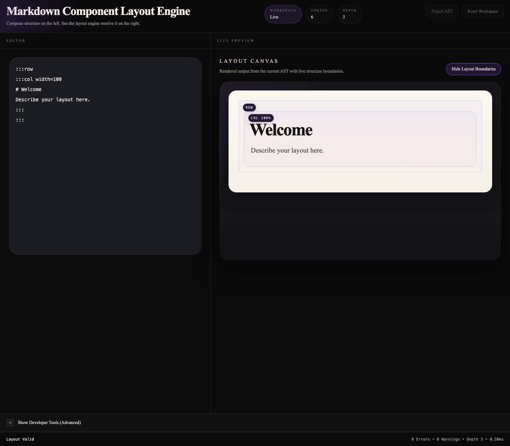
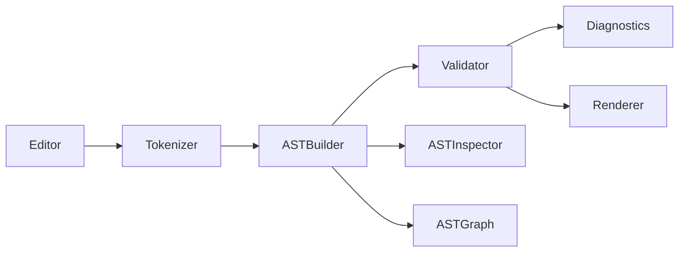
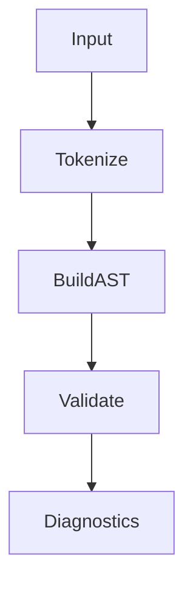
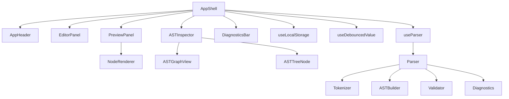
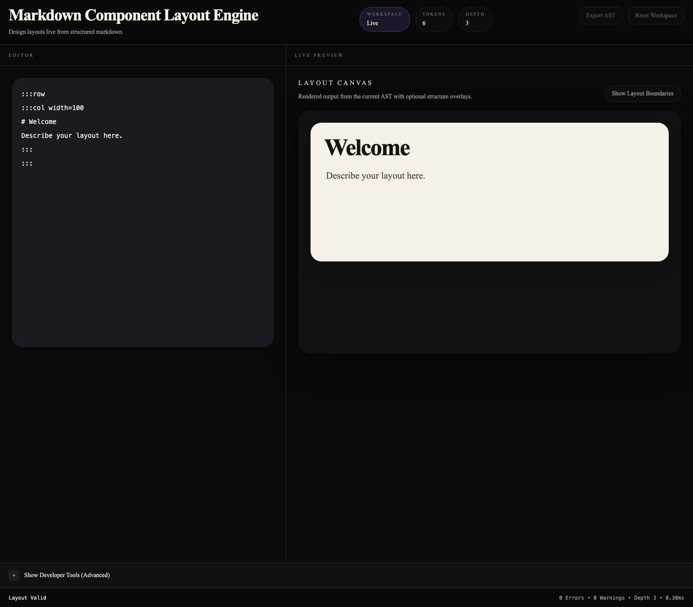
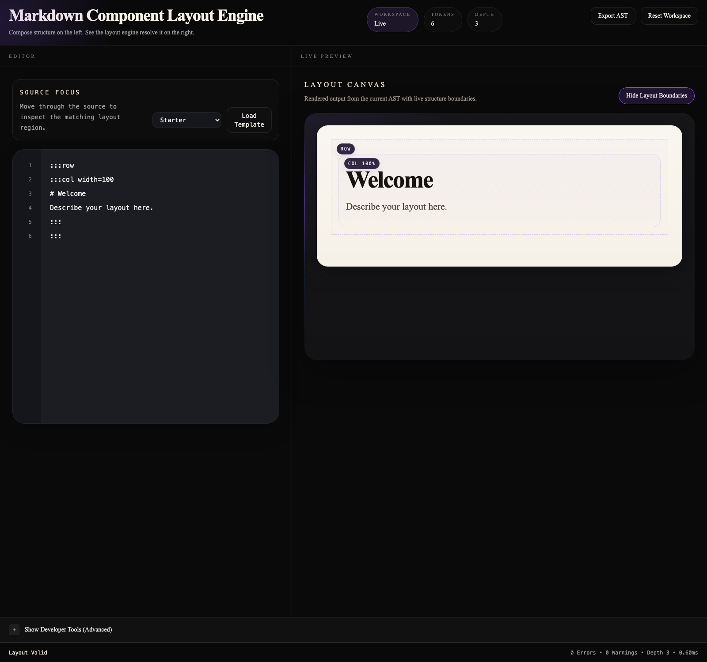
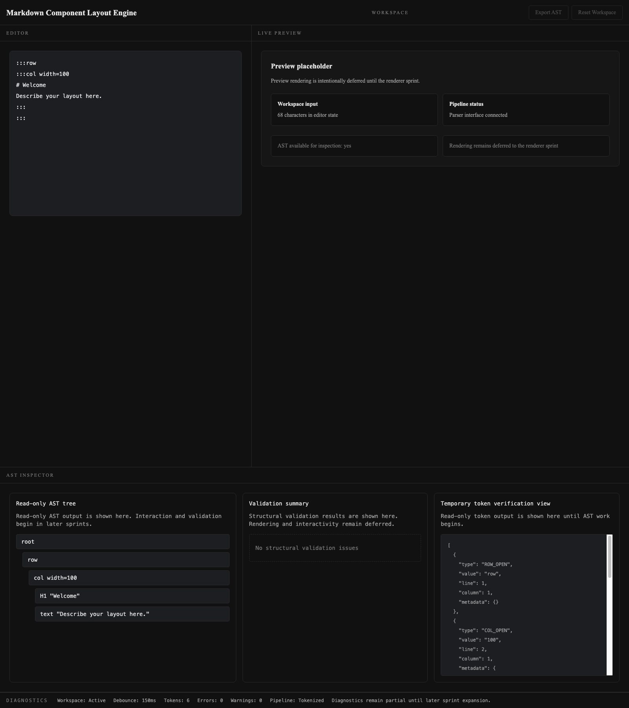

# Markdown Component Layout Engine



[](#testing)
[](#testing)
[](#testing)
[](./LICENSE)
[](https://vite.dev/)
[](https://react.dev/)

Parser-driven layout authoring for structured markdown.

Markdown Component Layout Engine (MCL) is a React + Vite application that turns a constrained markdown-based layout language into a validated Abstract Syntax Tree, an inspectable graph, and a live visual canvas. It is built as both a product-facing authoring experience and an engineering-facing parsing toolchain.

## Why This Project Exists

Traditional markdown is excellent for linear content, but it breaks down when documents need intentional spatial structure. Headings, paragraphs, and lists are easy; dashboards, split panels, callout-driven documentation, and layout-aware composition are not.

This project exists to explore a different model:

- markdown as structured layout input instead of only prose
- a parser-first workflow instead of ad hoc rendering
- explicit grammar, AST construction, validation, and diagnostics
- a live editor where the author can inspect both the rendered result and the tree that produced it

MCL was designed to answer a practical question: what if layout documents were treated like a small language with compiler-style feedback, instead of just formatted text?

## Features

| Area                    | Included                                                            |
| ----------------------- | ------------------------------------------------------------------- |
| Custom grammar          | `row`, `col`, `info`, headings, and text                            |
| Tokenizer               | Source-aware token generation with line and column metadata         |
| AST Builder             | Stable node IDs, parent-child relationships, source ranges          |
| Structural Validator    | Grammar-aware nesting rules, width checks, empty-container warnings |
| Diagnostics Engine      | Token count, AST depth, parse timing, error aggregation             |
| Preview Renderer        | AST-driven React rendering into a layout canvas                     |
| AST Inspector           | Read-only outline view with expand/collapse and selection sync      |
| AST Graph Visualization | Tree-style graph view for parser inspection                         |
| Template System         | Starter, dashboard, and documentation templates                     |
| Export AST              | Browser download of `ast.json`                                      |
| Persistence             | Local workspace persistence with failure-safe fallback              |
| Automated QA            | Vitest, React Testing Library, Playwright, coverage reporting       |

## Architecture Overview

### High-Level Pipeline



### Parser Pipeline



### Frontend Architecture



## Grammar Specification

### Supported Blocks

- `:::row`
- `:::col width=<number>`
- `:::info`
- `:::`
- `# Heading 1`
- `## Heading 2`
- `### Heading 3`
- plain text lines

### Valid Example

```md
:::row
:::col width=30

# Sidebar

:::info
Navigation
:::
:::
:::col width=70

# Main Content

Overview text
:::
:::
```

### Another Valid Example

```md
# Documentation Page

:::row
:::col width=35

## Navigation

Getting Started
Components
Examples
:::
:::col width=65

## Overview

Use this template to sketch a documentation-style layout.
:::info
Tip: keep content blocks concise for clearer previews.
:::
:::
:::
```

### Invalid Examples

`col` at the root level is invalid:

```md
:::col width=100
Hello
:::
```

Nested `row` inside `col` is intentionally invalid in the frozen grammar:

```md
:::row
:::col width=100
:::row
:::col width=100
Nested
:::
:::
:::
:::
```

### Frozen Grammar Constraints

- `ROOT` can contain `ROW`, `INFO`, headings, and text
- `ROW` can contain `COL` only
- `COL` can contain `H1`, `H2`, `H3`, `TEXT`, and `INFO` only
- `INFO` can contain `H1`, `H2`, `H3`, and `TEXT` only
- `width` defaults to `100` when omitted
- widths `<= 0`, `> 100`, or non-numeric are invalid
- nested rows inside columns are out of scope for the current language version

## AST Structure

Each generated node follows the current runtime contract:

```json
{
  "id": "node-2",
  "type": "col",
  "width": 30,
  "startLine": 2,
  "endLine": 7,
  "children": [
    {
      "id": "node-3",
      "type": "H1",
      "content": "Sidebar",
      "startLine": 3,
      "endLine": 3,
      "children": []
    }
  ]
}
```

Important properties:

- `id`: stable within a generated AST and unique for that parse result
- `type`: semantic node type such as `row`, `col`, `info`, `H1`, or `text`
- `children`: recursive child array
- `startLine` / `endLine`: source range metadata
- `width`: present on column nodes
- `content`: present on leaf nodes

## Screenshots








## Testing

The project includes a full release-quality QA stack:

- `Vitest` for parser, validator, diagnostics, templates, and integration logic
- `React Testing Library` for UI interaction and synchronization tests
- `Playwright` for end-to-end browser workflows

Current measured coverage:

| Metric     | Value    |
| ---------- | -------- |
| Statements | `92.20%` |
| Branches   | `79.79%` |
| Functions  | `90.29%` |
| Lines      | `92.24%` |

Validated release checks:

- `npm run lint`
- `npm test`
- `npm run test:coverage`
- `npm run test:e2e`
- `npm run build`

Detailed QA artifacts:

- [Testing Strategy](docs/TESTING.md)
- [QA Report](docs/QA_REPORT.md)
- [Release Checklist](docs/RELEASE_CHECKLIST.md)

## Installation

```bash
npm install
npm run dev
```

The local development server starts with Vite.

## Scripts

| Script                  | Purpose                                 |
| ----------------------- | --------------------------------------- |
| `npm run dev`           | Start the Vite development server       |
| `npm run build`         | Create the production build in `dist/`  |
| `npm run preview`       | Preview the production build locally    |
| `npm run lint`          | Run ESLint across the codebase          |
| `npm test`              | Run Vitest in CI mode                   |
| `npm run test:watch`    | Run Vitest in watch mode                |
| `npm run test:ui`       | Open the Vitest UI                      |
| `npm run test:coverage` | Generate coverage reports               |
| `npm run test:e2e`      | Run Playwright browser tests            |
| `npm run qa:release`    | Run the full release verification stack |
| `npm run format`        | Format the repository with Prettier     |
| `npm run format:check`  | Check formatting without changing files |

## Deployment

This repository is prepared for Vercel static deployment.

Quick path:

```bash
npm run build
```

Vercel configuration is included in [vercel.json](vercel.json), and the full deployment notes live in [docs/DEPLOYMENT.md](docs/DEPLOYMENT.md).

Environment requirements:

- no server-side secrets
- no external API keys
- browser `localStorage` for persistence
- browser download support for AST export

## Project Structure

```text
docs/
  architecture/
  screenshots/
  viva/
  DEPLOYMENT.md
  QA_REPORT.md
  RELEASE_AUDIT.md
  RELEASE_CHECKLIST.md
  TESTING.md

src/
  components/
    ast/
    diagnostics/
    editor/
    layout/
    preview/
  constants/
  contracts/
  hooks/
  parser/
  styles/
  test/
  utils/
  App.jsx
  main.jsx

tests/
  e2e/
```

## Lessons Learned

This project became much more interesting once it stopped being “just a markdown editor” and started being treated like a small language runtime.

Key engineering lessons:

- tokenizer quality matters because line and column metadata determine whether diagnostics feel professional
- AST design drives everything downstream: validation, graph views, renderer behavior, and selection sync
- structural validation should operate on parse artifacts, not on loosely coupled UI assumptions
- renderer purity is worth protecting because it keeps the preview deterministic and debuggable
- synchronization between editor, AST, and preview is a state-ownership problem before it is a UI problem
- a strong automated test stack changes the maturity of the whole project, especially once export, persistence, and browser behavior enter the system

## Future Roadmap

### Completed

- parser-driven MCL input pipeline
- tokenizer with source metadata
- AST builder with source ranges and stable generated node IDs
- structural validator
- diagnostics engine
- preview renderer
- AST outline inspector
- AST graph visualization
- template loading
- AST export
- local persistence
- automated unit, integration, stress, and E2E testing
- release and deployment documentation

### Potential V2

- nested layout grammar expansion
- visual drag-and-drop editor
- reusable layout components
- plugin system
- collaborative editing
- semantic import/export flows

These are future ideas, not part of the frozen current release.

## Author

**Aaryan Kuchekar**

- GitHub: `https://github.com/your-github-username`
- LinkedIn: `https://www.linkedin.com/in/your-linkedin-handle`
