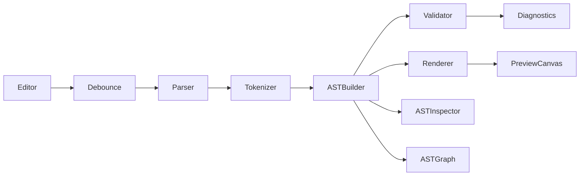
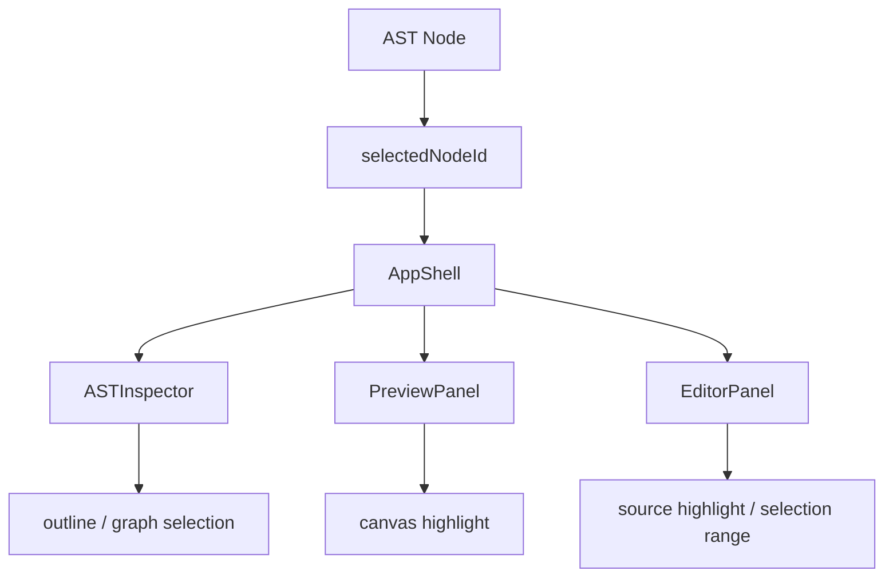
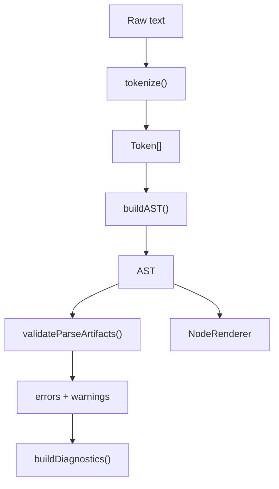
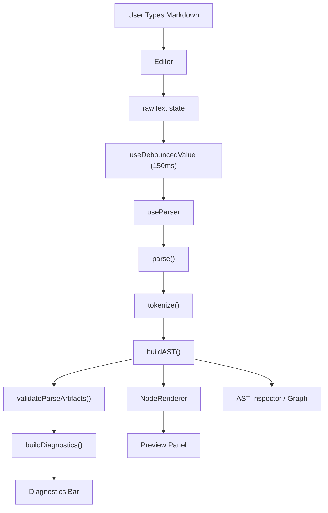

# MCL Studio Engineering Handbook

This handbook is for **you**, the project author.

Its purpose is not just to describe the repository. Its purpose is to rebuild
your entire mental model of the project so that you can:

- explain the app clearly to any external panel
- defend your React decisions with confidence
- explain the parser pipeline step by step
- describe why each important file exists
- answer implementation questions without panicking

The most important rule of this handbook is:

> Whenever there is a choice between describing what exists and explaining why it exists, prioritize **why**.

That is what makes this useful in viva, interviews, demos, and future revision.

---

## Part 1 — What This Project Really Is

### Short answer

**MCL Studio** stands for **Markdown Component Layout Studio**.

It is a React application where the user writes a small markdown-like layout language in an editor, and the application:

1. tokenizes the input
2. builds an AST
3. validates the structure
4. computes diagnostics
5. renders the AST into a layout canvas

So this project is **not** just a markdown previewer.

It is a:

- parser-driven frontend application
- live layout authoring tool
- React state synchronization case study
- structured rendering system

### One-line description for viva

> MCL Studio is a React-based layout authoring tool that parses a custom markdown-like syntax into an AST, validates it, and renders the result as a live visual layout canvas.

### Two-minute explanation for anyone

If someone asks, “What does your project do?”, this is a strong answer:

> My project is called MCL Studio. It lets the user write a small markdown-like language for layout, not just plain text formatting. The user can define rows, columns, headings, info blocks, and text. The application then parses that input in multiple stages: tokenization, AST construction, validation, diagnostics, and rendering. I built it in React because the app has multiple synchronized views: the editor, live preview, AST inspector, AST graph, and diagnostics panel. The goal was not only to render a layout, but to clearly show the full parser pipeline in a frontend product.

### What problem it solves

Traditional markdown is great for:

- headings
- paragraphs
- lists
- linear content

But it is weak for:

- sidebars
- dashboards
- multi-column structure
- explicit layout relationships

MCL Studio solves that by introducing **structure**.

Instead of treating user input like plain display text, it treats it like a
small language with rules.

That is why the project needed:

- a tokenizer
- an AST
- a validator
- a renderer

Without those, it would just be a normal previewer.

---

## Part 1.5 — The Actual Project Story

This section answers a very important non-technical question:

> What was the case study actually asking me to build?

### What was given

The project was not just asking for:

- a markdown viewer
- a note-taking app
- a plain text editor

It was asking for a system where layout becomes structured, validated, and explainable.

### What was expected

The expected technical direction was:

- React frontend
- custom layout-oriented input
- parser pipeline
- AST generation
- validation
- live preview

### Why normal markdown was not enough

Normal markdown supports:

- headings
- paragraphs
- lists

But it does not naturally support:

- rows
- columns
- width-aware structure
- explicit container nesting

That is why the project needed a custom grammar.

### The real challenge

The real engineering challenge was:

```text
Take structured user input
↓
understand it as layout
↓
validate it
↓
render it live
↓
make the whole process explainable
```

### The approach

```text
Problem:
Plain markdown is not enough for layout authoring.

Approach:
Create a constrained custom grammar.

Implementation:
React UI + tokenizer + AST builder + validator + renderer.

Result:
MCL Studio.
```

### Why this section matters

Many students can explain what their UI does.
Fewer can explain why the parser was needed in the first place.

This section gives you that project story clearly.

## Part 2 — Project Explained in Plain English

Assume the listener knows **no React**, **no AST**, and **no parsing**.

### The user’s point of view

The user sees:

- an editor on the left
- a layout canvas on the right
- developer tools below when needed

The user types input like this:

```md
:::row
:::col width=100
# Welcome
Describe your layout here.
:::
:::
```

The app does **not** directly display that text.

Instead it asks:

- Is this a row?
- Is this a column?
- Is the width valid?
- Which lines belong inside which container?
- Is the structure legal according to the grammar?

Only after answering those questions does the preview get rendered.

### The internal life cycle

This is the project’s true life cycle:

```text
User types source
→ React state updates
→ value is debounced
→ parser runs
→ tokens are generated
→ AST is built
→ AST is validated
→ diagnostics are built
→ AST is rendered
→ preview, inspector, graph, and diagnostics update together
```

### Why the AST matters

The AST is the project’s central idea.

Without the AST:

- validation would be much weaker
- graph view would not exist
- export would be less meaningful
- selection synchronization would be messy
- the app would become “string in, HTML out”

With the AST:

- the project has a real intermediate representation
- the parser pipeline becomes defensible
- the UI can render from structure instead of guessing from text

### Why React was chosen

React was a good fit because the application has several synchronized surfaces:

- editor
- preview
- AST outline
- AST graph
- diagnostics
- header status

These all depend on shared state.

React handles this well through:

- component composition
- state ownership
- props
- hooks
- rerendering when state changes

---

## Part 3 — The Fastest Way To Explain The Project

If an examiner asks, “Explain your project in simple terms,” use one of these formats.

### 30-second version

> MCL Studio is a React app that converts a custom markdown-like layout syntax into a validated visual layout. It tokenizes the input, builds an AST, validates the structure, and renders the result live. It also exposes the AST in inspector and graph views.

### 60-second version

> The user writes structured source text using commands like row, col, and info. That raw text is stored in React state, then debounced to avoid reparsing on every keystroke. A parser pipeline then tokenizes the text, builds an AST, validates nesting and width rules, computes diagnostics, and returns a stable parse result. React components then render the preview canvas, diagnostics, and AST tools from that parse result. So the app is both a usable product and a clear parser demonstration.

### 2-minute technical version

> The app is built around AppShell, which is the main state owner. It stores the raw editor text, selected node ID, template state, export state, collapse state, and layout boundary mode. The raw text is passed through a custom debounce hook so parsing happens after a 150ms delay. The debounced text goes into a custom parser hook, which memoizes the parse result. The parser itself is layered into tokenizer, AST builder, validator, and diagnostics utilities. The tokenizer emits tokens with type, value, line, column, and metadata. The AST builder uses a stack to build hierarchical nodes with IDs and source ranges. The validator checks grammar rules and width constraints. Then the renderer recursively maps AST nodes into React UI. The result powers the preview, AST outline, AST graph, diagnostics, persistence, and export features.

---

## Part 3.5 — My Contributions

If an external asks:

> Did you build this project yourself?

you should answer clearly and professionally.

### Core contributions you should be able to defend

- React component architecture
- parser pipeline understanding
- AST generation logic
- validation logic understanding
- state synchronization design
- localStorage persistence design
- export workflow understanding
- UI/UX refinement decisions

### Professional wording if needed

> Development used AI-assisted engineering tools for implementation acceleration, debugging, testing support, and refinement. However, the architecture understanding, feature reasoning, system explanation, review direction, and final integration understanding were owned by me as the project author.

### What really proves ownership

Tools are not the real issue in viva.
Understanding is.

If you can clearly explain:

- why `AppShell` exists
- why parsing is layered
- why AST is necessary
- why validator is separate from AST building
- why only source text is persisted
- why selection is centralized

then you are demonstrating real ownership.

## Part 4 — React Concepts Through This Exact Project

This section is extremely important for viva.

Do not memorize React definitions in isolation.
Learn them through your own implementation.

### 4.1 Components

A React component is a reusable UI unit that returns JSX.

In MCL Studio, components are not random pieces. Each one has a specific job:

- `AppHeader` → branding, top-level status, export/reset actions
- `EditorPanel` → textarea, line numbers, template controls
- `PreviewPanel` → layout canvas shell
- `NodeRenderer` → recursive AST-to-UI renderer
- `ASTInspector` → graph + outline + validation + diagnostics
- `DiagnosticsBar` → compact bottom status

#### Why components matter here

Because the app is made of multiple synchronized panels.

If everything were in one file:

- it would be hard to explain
- parser logic and UI logic would mix
- state would become harder to reason about

### 4.2 Props

Props are how parent components pass data and handlers to child components.

In this project, `AppShell` is the main prop distributor.

For example:

```jsx
<PreviewPanel
  isDebouncing={isDebouncing}
  onSelectNode={(nodeId) => handleSelectNode(nodeId, 'preview')}
  parseResult={parseResult}
  selectedNodeId={safeSelectedNodeId}
  showLayoutBoundaries={showLayoutBoundaries}
  onToggleLayoutBoundaries={() =>
    setShowLayoutBoundaries((current) => !current)
  }
/>
```

This tells you something important:

- `PreviewPanel` does not own parsing
- `PreviewPanel` does not own shared selection state
- `PreviewPanel` receives what it needs

That is a clean React design.

### 4.3 State

State is changing data that affects rendering.

The most important state lives in `src/components/layout/AppShell.jsx`.

```jsx
const [rawText, setRawText, clearRawText] = useLocalStorage(
  WORKSPACE_STORAGE_KEY,
  UI_TEXT.starterTemplate,
);
const [showDeveloperTools, setShowDeveloperTools] = useState(false);
const [showLayoutBoundaries, setShowLayoutBoundaries] = useState(true);
const [selectedNodeId, setSelectedNodeId] = useState(null);
const [selectionOrigin, setSelectionOrigin] = useState('inspector');
const [collapsedNodeIds, setCollapsedNodeIds] = useState([]);
const [activeTemplateId, setActiveTemplateId] = useState('starter');
const [exportState, setExportState] = useState('idle');
```

This is one of the most viva-important snippets in the whole project.

#### What this proves

It proves that:

- React state is the source of truth for the UI
- different kinds of UI behavior are tracked separately
- the project uses **state ownership**, not random local state everywhere

### 4.4 Why `AppShell` owns shared state

This is a likely viva question.

**Question:** Why not store state separately in the editor, preview, and AST inspector?

**Answer:** Because those panels are synchronized views of the same document. If each one kept its own selection or source state, the system would drift or duplicate logic. `AppShell` centralizes shared state so all dependent panels receive the same truth through props.

### 4.5 `useState`

`useState` is used when a component needs a value that survives rerenders and can trigger UI updates.

Examples in this project:

- editor content
- selected AST node
- template selection
- export success/error state
- developer-tools visibility
- layout-boundary visibility

#### What to say in viva

> I used `useState` for interactive UI values that change over time and must trigger rerendering. The best example is `selectedNodeId`, which synchronizes the preview, AST inspector, and editor source focus.

### 4.6 `useEffect`

`useEffect` is used when something should happen **after render** because data changed.

#### Example 1: selection synchronization in the editor

From `src/components/editor/EditorPanel.jsx`:

```jsx
useEffect(() => {
  if (
    !textareaRef.current ||
    selectionOrigin === 'editor' ||
    !selectedNode ||
    typeof selectedNode !== 'object'
  ) {
    return;
  }

  const range = getSelectionRangeForNode(value, selectedNode);

  if (!range) {
    return;
  }

  textareaRef.current.focus();
  textareaRef.current.setSelectionRange(range.start, range.end);
}, [selectedNode, selectionOrigin, value]);
```

#### What this does

When a node is selected in another view:

- compute its text range in the editor
- focus the textarea
- highlight the corresponding source range

This is an excellent example of `useEffect`.

The component first renders, then React runs this effect because dependencies changed.

#### Example 2: persistence

From `src/hooks/useLocalStorage.js`:

```jsx
useEffect(() => {
  if (typeof window === 'undefined') {
    return;
  }

  try {
    window.localStorage.setItem(key, value);
  } catch {
    // Ignore storage failures and keep the in-memory workspace usable.
  }
}, [key, value]);
```

This is another strong example:

- state changes
- effect reacts
- browser API is updated

### 4.7 Custom Hooks

Custom hooks are one of the strongest React ideas demonstrated in this project.

#### `useDebouncedValue`

From `src/hooks/useDebouncedValue.js`:

```jsx
export function useDebouncedValue(value, delay) {
  const [debouncedValue, setDebouncedValue] = useState(value);

  useEffect(() => {
    const timeoutId = window.setTimeout(() => {
      setDebouncedValue(value);
    }, delay);

    return () => {
      window.clearTimeout(timeoutId);
    };
  }, [delay, value]);

  return debouncedValue;
}
```

#### Why it exists

If parsing happened on every keystroke:

- typing would feel heavier
- parse work would happen too often
- UI feedback might become noisy

So this hook delays the expensive pipeline.

#### What to say in viva

> I used a custom debounce hook to improve the typing experience. It returns a delayed version of the editor text, so parsing is triggered only after a 150ms pause instead of every keypress.

#### `useLocalStorage`

```jsx
function readStoredValue(key, defaultValue) {
  if (typeof window === 'undefined') {
    return defaultValue;
  }

  try {
    const storedValue = window.localStorage.getItem(key);
    return storedValue ?? defaultValue;
  } catch {
    return defaultValue;
  }
}
```

This hook does more than save text.
It also makes storage access resilient.

That matters because browser APIs can fail.

#### `useParser`

From `src/hooks/useParser.js`:

```jsx
export function useParser(rawText) {
  return useMemo(() => {
    try {
      return parse(rawText);
    } catch {
      return {
        tokens: [],
        ast: null,
        errors: [
          {
            type: 'parser_failure',
            code: 'parser_failure',
            severity: 'error',
            message: 'Internal parser failure',
            line: 0,
            column: 0,
          },
        ],
        warnings: [],
        diagnostics: {
          tokenCount: 0,
          astDepth: 0,
          parseTime: 0,
          errorCount: 1,
        },
      };
    }
  }, [rawText]);
}
```

#### Why it exists

It keeps parser invocation:

- outside UI rendering code
- memoized by input text
- protected by a fallback contract

That is good architecture.

### 4.8 Controlled Components

The editor textarea is a controlled input.

From `EditorPanel.jsx`:

```jsx
<textarea
  id="workspace-editor"
  ref={textareaRef}
  className="editor-textarea"
  onChange={(event) => onChange(event.target.value)}
  spellCheck={false}
  value={value}
/>
```

That means:

- the value comes from React state
- changes go through React
- the component does not own the authoritative source text locally

This is important because the parser pipeline depends on exact source text.

### 4.9 Conditional Rendering

Conditional rendering appears throughout the app.

Example from `PreviewPanel.jsx`:

```jsx
{hasRenderableAst ? (
  <div className="preview-canvas">
    <div className="preview-stage">
      <NodeRenderer
        node={ast}
        onSelectNode={onSelectNode}
        selectedNodeId={selectedNodeId}
        showLayoutBoundaries={showLayoutBoundaries}
      />
    </div>
  </div>
) : (
  <div className="preview-empty-state">
    <p className="preview-empty-title">{UI_TEXT.previewPlaceholder}</p>
  </div>
)}
```

This means React shows different UI based on data state.

### 4.10 LocalStorage

One likely viva question:

**Question:** Why use `localStorage`?

**Answer:** Because this project is frontend-only, and the user still benefits from persistence across refreshes. `localStorage` is enough for restoring workspace text without introducing backend complexity.

Important design point:

The app stores **only raw source text**, not:

- AST
- tokens
- diagnostics
- selection state

Why?

Because those are derived values.
Derived values should be recomputed from the source of truth.

---

## Part 5 — Repository Deep Dive

This section explains the repository by **responsibility**.

### `src/components`

This folder contains the visible application surfaces.

Subfolders:

- `layout/` → global workspace structure
- `editor/` → authoring surface
- `preview/` → canvas and AST-driven rendering
- `ast/` → outline and graph-based AST inspection
- `diagnostics/` → compact status UI

Why this folder exists:

Because visual concerns should be separated from hooks, parser stages, and utilities.

### `src/hooks`

This folder contains reusable React behavior:

- `useParser.js`
- `useLocalStorage.js`
- `useDebouncedValue.js`

Why it exists:

Because these behaviors are stateful and reusable, but they are not visual UI.

### `src/parser`

This folder is the language engine:

- `tokenizer.js`
- `astBuilder.js`
- `validator.js`
- `parser.js`

Why it exists:

Because the application’s deepest engineering value is here.
This folder converts plain text into structured meaning.

### `src/utils`

This folder holds small pure helpers:

- `diagnostics.js`
- `astDepth.js`

Why it exists:

To avoid mixing diagnostic computation into parser orchestration or React UI files.

### `src/constants`

This folder centralizes:

- token types
- templates
- UI labels

Why it exists:

Because repeated strings should not be scattered through components and parser stages.

### `src/contracts`

This folder documents the main data shapes in JSDoc:

- `Token`
- `ASTNode`
- `ValidationError`
- `ParseResult`

Why it exists:

Because even without TypeScript, this project has stable contracts.

### `src/styles`

This folder contains the global visual system.

Why it exists:

Because the app’s identity and synchronization cues depend heavily on shared styling rules.

### `tests` and `src/test`

These folders support:

- unit/integration testing
- shared fixtures
- E2E workflow validation

Why they exist:

Because the project was taken through a real QA phase, not left as a demo-only prototype.

### `docs`

This folder contains:

- QA docs
- release docs
- deployment docs
- report docs
- handbook docs

Why it exists:

Because the project is meant to be presentable, teachable, and archival.

### Visual folder explorer

This is the fastest mental map of the repository:

```text
src
├── components
│   ├── ast
│   ├── diagnostics
│   ├── editor
│   ├── layout
│   └── preview
├── constants
├── contracts
├── hooks
├── parser
├── styles
└── utils
```

### How to think about this tree

- `components/` = visible UI surfaces
- `hooks/` = reusable React behavior
- `parser/` = language understanding engine
- `utils/` = pure helper logic
- `constants/` = shared static values
- `contracts/` = documented shapes
- `styles/` = visual system

If you remember this split, navigating the codebase becomes much easier.

---

## Part 6 — Critical File Breakdown

This section answers a very viva-specific question:

> If someone opens a file and asks why it exists, can you answer confidently?

### `src/App.jsx`

**Purpose:** top-level application entry component  
**Responsibility:** mount `AppShell`  
**Inputs:** none beyond normal React bootstrapping  
**Outputs:** root UI tree  
**Dependencies:** `AppShell`  
**Impact if removed:** the app has no root component composition

Why it exists:

`App.jsx` keeps the entry simple so the real orchestration can live in one clearly named place: `AppShell`.

### `src/components/layout/AppShell.jsx`

This is the most important file in the repository.

#### Why it exists

Because the app has one core challenge:

- multiple panels
- one document
- one shared parse result
- one shared selection model

`AppShell` is the coordinator that solves that.

#### Its main responsibilities

- own shared UI state
- call custom hooks
- derive safe selection
- connect editor, preview, and inspector
- handle reset
- handle export
- handle template loading

#### Important snippet

```jsx
const debouncedText = useDebouncedValue(rawText, 150);
const parseResult = useParser(debouncedText);
const isDebouncing = rawText !== debouncedText;
```

This small snippet explains a lot:

- editor text changes immediately
- parse input changes later
- the UI knows when debounce is still active

#### Another important snippet

```jsx
const safeSelectedNodeId = hasNodeId(ast, selectedNodeId)
  ? selectedNodeId
  : null;
const selectedNode = safeSelectedNodeId
  ? findNodeById(ast, safeSelectedNodeId)
  : null;
```

This protects the app from stale selections after reparsing.

That is a very strong architecture decision.

#### What would break if removed

If `AppShell` disappeared:

- no central state owner
- no panel synchronization
- no clean parser flow in UI
- no shared selection model

### `src/components/editor/EditorPanel.jsx`

#### Why it exists

Because editing is a separate concern from rendering.

The editor needs:

- textarea control
- line numbers
- cursor tracking
- template controls
- source focus highlighting

These do not belong in the preview or parser.

#### Important snippet

```jsx
function handleCursorSync(event) {
  if (typeof onSelectNodeByLine !== 'function') {
    return;
  }

  const offset = event.target.selectionStart ?? 0;
  const line = getLineFromOffset(value, offset);
  onSelectNodeByLine(line);
}
```

This is an important React idea:

- the editor does not decide which AST node is selected
- it reports intent upward using a handler
- `AppShell` converts that into shared state

That is clean parent-child communication.

### `src/components/preview/PreviewPanel.jsx`

#### Why it exists

Because the preview is the product payoff.

It needs to:

- decide if there is renderable AST
- show an empty state when there is none
- host the layout canvas
- expose the layout-boundary toggle

#### Important snippet

```jsx
const ast =
  parseResult?.ast && typeof parseResult.ast === 'object'
    ? parseResult.ast
    : null;
const astChildren = Array.isArray(ast?.children) ? ast.children : [];
const hasRenderableAst = ast !== null && astChildren.length > 0;
```

This is good defensive UI coding.

The component does not assume parser output is always perfect.

### `src/components/preview/NodeRenderer.jsx`

This file is the bridge between **parser output** and **visible UI**.

#### Why it exists

Because the AST should not be rendered in one huge conditional block inside `PreviewPanel`.

Instead, rendering is delegated to a recursive renderer.

#### Core idea

```jsx
if (node.type === 'row') {
  return <div className="preview-row">{renderNodeChildren(children)}</div>;
}

if (node.type === 'col') {
  return (
    <div style={{ width: `${width}%`, flexBasis: `${width}%` }}>
      {renderNodeChildren(children)}
    </div>
  );
}
```

This shows that:

- row becomes a flex container
- col uses width metadata
- recursion renders nested children

#### Why this is a strong architecture choice

Because the renderer:

- does not parse
- does not validate
- does not mutate the AST
- only maps node types to JSX

That is excellent separation of concerns.

### `src/components/ast/ASTInspector.jsx`

#### Why it exists

Because the project needed a way to prove the parser pipeline visually.

The AST inspector is not just cosmetic.
It demonstrates:

- the AST is real
- validation is real
- diagnostics are real
- tokens are real

#### What it combines

- graph mode
- outline mode
- validation summary
- token JSON view
- diagnostics cards

This is basically the engineering dashboard of the project.

### `src/components/ast/ASTGraphView.jsx`

#### Why it exists

Because ASTs are easier to understand visually than in raw JSON.

#### Important snippet

```jsx
const isSelected = nodeId !== null && nodeId === selectedNodeId;
```

This tiny line shows the main selection rule:

- graph nodes do not own global selection
- they reflect the selected ID passed from `AppShell`

### `src/hooks/useParser.js`

#### Why it exists

Because UI components should not directly contain parser orchestration logic.

This hook:

- memoizes parse results
- calls `parse()`
- returns a failure-safe contract if something goes wrong

This makes the rest of the app simpler.

### `src/hooks/useLocalStorage.js`

#### Why it exists

Because persistence is useful, but it should not be hand-coded inside `AppShell`.

This hook handles:

- initial restore
- save on change
- clear/reset
- failure-safe storage access

### `src/hooks/useDebouncedValue.js`

#### Why it exists

Because reparsing on every keystroke is wasteful.

This hook is small, but it greatly improves UX.

### `src/parser/tokenizer.js`

#### Why it exists

Because later parser stages need structured units, not raw strings.

#### Important snippet

```jsx
const colMatch = trimmedLine.match(/^:::col(?:\\s+width=(\\S+))?$/);
if (colMatch) {
  const widthValue = colMatch[1] ?? '100';
  const numericWidth = Number(widthValue);
  const metadata = Number.isNaN(numericWidth)
    ? { width: widthValue }
    : { width: numericWidth };

  tokens.push(
    createToken(TOKEN_TYPES.COL_OPEN, line, column, widthValue, metadata),
  );
}
```

This one snippet proves:

- tokenizer understands grammar syntax
- width defaulting happens here
- source metadata is attached immediately

### `src/parser/astBuilder.js`

#### Why it exists

Because tokens are flat, but layout structure is hierarchical.

#### Important snippet

```jsx
const stack = [root];

for (const token of tokens) {
  const currentParent = stack[stack.length - 1];

  if (
    token.type === TOKEN_TYPES.ROW_OPEN ||
    token.type === TOKEN_TYPES.COL_OPEN ||
    token.type === TOKEN_TYPES.INFO_OPEN
  ) {
    const node = createContainerNode(token, nextNodeId);
    currentParent.children.push(node);
    stack.push(node);
    continue;
  }
}
```

This is the classic stack-based parser idea.

It is one of the best snippets to understand the AST builder.

### `src/parser/validator.js`

#### Why it exists

Because parsing alone does not guarantee legal structure.

The validator answers:

- is the nesting valid?
- is the width valid?
- are there extra closes?
- are there unclosed blocks?

#### Important snippet

```jsx
if (node.type === 'row') {
  for (const child of node.children) {
    if (child.type !== 'col') {
      errors.push(
        createIssue(
          'invalid_nesting',
          'ROW can contain COL only',
          child.startLine,
          1,
        ),
      );
    }
  }
}
```

This is a great viva snippet because it directly encodes a grammar rule.

### `src/parser/parser.js`

This is the orchestration file.

#### Important snippet

```jsx
const tokens = tokenize(safeRawText);
const ast = buildAST(tokens);
const validationResult = validateParseArtifacts({ tokens, ast });
const diagnostics = buildDiagnostics({
  tokens,
  ast,
  errors,
  parseTime,
});
```

This is the whole pipeline in one place.

If asked “where is the parser pipeline assembled?”, this is the answer.

### `src/utils/diagnostics.js`

#### Why it exists

Because diagnostics should be computed in one place, not inside UI components.

#### Important snippet

```jsx
return {
  tokenCount: safeTokens.length,
  astDepth: ast ? calculateDepth(ast) : 0,
  parseTime,
  errorCount: safeErrors.length,
};
```

### `src/utils/astDepth.js`

#### Why it exists

Because tree depth is useful diagnostic information and should remain pure.

#### Important snippet

```jsx
if (children.length === 0) {
  return depth;
}

return Math.max(...children.map((child) => calculateDepth(child, depth + 1)));
```

This is a recursive utility and a good example of tree processing.

---

## Part 6.5 — How To Explain Each Important File In 20 Seconds

This is your quick-reference section for stressful moments.

| File | One-line explanation |
| --- | --- |
| `AppShell.jsx` | Central state coordinator that connects all major panels and shared behavior. |
| `AppHeader.jsx` | Displays branding, status, and top-level actions like export and reset. |
| `EditorPanel.jsx` | Controlled markdown/layout editor with template controls and source-linked focus behavior. |
| `PreviewPanel.jsx` | Hosts the AST-driven preview canvas and layout-boundary controls. |
| `NodeRenderer.jsx` | Recursively converts AST nodes into React JSX elements. |
| `ASTInspector.jsx` | Developer-facing AST dashboard combining graph, outline, validation, tokens, and diagnostics. |
| `ASTGraphView.jsx` | Visual tree representation of the AST for easier structural understanding. |
| `useParser.js` | React hook wrapper that memoizes parser output and guarantees a safe fallback result. |
| `useDebouncedValue.js` | Delays expensive parse updates so typing remains responsive. |
| `useLocalStorage.js` | Persists only workspace source text safely in browser storage. |
| `tokenizer.js` | Converts source text into typed tokens with metadata. |
| `astBuilder.js` | Converts flat token arrays into a hierarchical AST using a stack. |
| `validator.js` | Enforces grammar and width rules over tokens and AST nodes. |
| `parser.js` | Orchestrates the entire parser pipeline and returns one stable parse result contract. |
| `diagnostics.js` | Builds parser metrics like token count, AST depth, parse time, and error count. |
| `astDepth.js` | Recursively calculates AST depth for diagnostics. |

### Why this table matters

In viva, the first sentence matters a lot.

If you can start with the correct one-line description, you can expand naturally from there.

---

## Part 6.6 — If This File Breaks, What Breaks?

This section helps you think in terms of system impact.

### If `tokenizer.js` breaks

```text
No reliable tokens
→ No reliable AST
→ No reliable validation
→ No meaningful preview
```

### If `astBuilder.js` breaks

- hierarchy is lost
- graph and outline become unreliable
- preview structure collapses
- validator loses true nesting context

### If `validator.js` breaks

- invalid layouts may appear valid
- width errors may be missed
- grammar enforcement weakens

### If `parser.js` breaks

- pipeline orchestration fails
- fallback safety may disappear
- UI panels may receive inconsistent parse results

### If `AppShell.jsx` breaks

- shared state ownership breaks
- panel synchronization breaks
- preview, editor, and inspector drift apart
- reset/export/template workflows may fail

### If `EditorPanel.jsx` breaks

- user input becomes unreliable
- source-linked selection stops working
- template actions become harder to use

### If `NodeRenderer.jsx` breaks

- AST may still exist
- but the visible layout may disappear or render incorrectly

### If `ASTInspector.jsx` or `ASTGraphView.jsx` breaks

- the app may still render layouts
- but the strongest parser-demonstration features become weaker

### If `useLocalStorage.js` breaks

- the app still works in memory
- but persistence across refreshes is lost

### Why this section matters

This helps you answer deeper questions like:

> Which files are critical?

> What is the blast radius of a failure?

That is the kind of answer that shows true systems understanding.

---

## Part 7 — Architecture Deep Dive

### 7.1 High-level architecture



### 7.2 The most important architecture rule

> Raw text never becomes UI directly.

This one sentence explains the entire app.

Instead:

- text becomes tokens
- tokens become AST
- AST becomes validated structure
- validated structure becomes preview UI

### 7.3 Why this architecture is strong

Because each stage has a single responsibility:

- tokenizer → recognize syntax
- AST builder → create hierarchy
- validator → enforce rules
- diagnostics → summarize state
- renderer → produce UI

That separation makes the project:

- easier to test
- easier to debug
- easier to explain
- easier to extend

### 7.4 State ownership architecture

`AppShell` is the single source of truth for shared state.

That means child components mostly do one of two things:

1. display data
2. send events upward

This is why the app stays synchronized.

### 7.5 Why derived data is not stored as state

This is a very important concept.

The app stores:

- `rawText`
- UI interaction state

The app does **not** store as independent long-lived state:

- tokens
- AST
- diagnostics

Why?

Because those are **derived from `rawText`**.

If derived data is stored separately and manually updated, bugs become more likely.

Instead:

- raw text changes
- parser reruns
- derived output is recomputed

That is cleaner.

### 7.6 Selection synchronization architecture

This is one of the coolest parts of the app.



#### Explanation

When a node is selected:

- the AST graph can highlight it
- the outline can highlight it
- the preview can highlight it
- the editor can highlight its source lines

This works because everything shares one `selectedNodeId`.

### 7.7 Why this is good React design

Because there is:

- one owner of shared state
- one flow of truth
- no duplicate selection models across panels

That is exactly what you should say if asked about state management.

---

## Part 7.5 — Code Execution Journey

This is one of the highest-value sections in the handbook.

It answers:

> If I type one character in the editor, which files execute in what order?

### High-level execution map

```text
User types in EditorPanel
↓
onChange(event.target.value)
↓
setRawText()
↓
AppShell state updates
↓
useDebouncedValue()
↓
debouncedText changes after 150ms
↓
useParser()
↓
parse()
↓
tokenize()
↓
buildAST()
↓
validateParseArtifacts()
↓
buildDiagnostics()
↓
parseResult returned
↓
PreviewPanel rerenders
ASTInspector rerenders
ASTGraphView rerenders
DiagnosticsBar rerenders
AppHeader rerenders
```

### File-by-file execution path

```text
src/components/editor/EditorPanel.jsx
↓
src/components/layout/AppShell.jsx
↓
src/hooks/useDebouncedValue.js
↓
src/hooks/useParser.js
↓
src/parser/parser.js
↓
src/parser/tokenizer.js
↓
src/parser/astBuilder.js
↓
src/parser/validator.js
↓
src/utils/diagnostics.js
↓
src/components/preview/PreviewPanel.jsx
↓
src/components/preview/NodeRenderer.jsx
↓
src/components/ast/ASTInspector.jsx
↓
src/components/ast/ASTGraphView.jsx
↓
src/components/diagnostics/DiagnosticsBar.jsx
```

### Why this section matters

Many students know files individually but cannot explain runtime sequence.

If you understand this flow, you can confidently explain:

- where input starts
- where parsing starts
- where rendering starts
- why multiple views update together

---

## Part 8 — Parsing Engine Deep Dive

This is the most important technical chapter in the project.

### 8.1 Parser pipeline overview



### 8.2 Tokenizer deep dive

The tokenizer reads the input **line by line**.

It decides what each meaningful line represents.

#### Input

```md
:::row
:::col width=70
# Main Content
Hello
:::
:::
```

#### Output idea

```js
[
  { type: 'ROW_OPEN', line: 1, column: 1, value: 'row', metadata: {} },
  { type: 'COL_OPEN', line: 2, column: 1, value: '70', metadata: { width: 70 } },
  { type: 'H1', line: 3, column: 1, value: 'Main Content', metadata: {} },
  { type: 'TEXT', line: 4, column: 1, value: 'Hello', metadata: {} },
  { type: 'BLOCK_CLOSE', line: 5, column: 1, value: ':::', metadata: {} },
  { type: 'BLOCK_CLOSE', line: 6, column: 1, value: ':::', metadata: {} },
]
```

#### Important concepts demonstrated

- lexical classification
- line metadata
- column metadata
- width extraction
- defaulting width to `100` when missing

### 8.3 AST builder deep dive

The AST builder turns a flat token array into a tree.

#### Why a tree is necessary

Because layout has parent-child structure.

A column belongs inside a row.
A heading belongs inside a column.
An info block belongs inside a column.

That cannot be represented well by a flat list.

#### Stack model

The AST builder uses a stack.

Mental model:

```text
Open row   -> push row
Open col   -> push col
H1         -> attach leaf to current parent
TEXT       -> attach leaf to current parent
Close :::  -> pop current container
```

#### Root node

The builder always creates:

```js
{
  id: 'root',
  type: 'root',
  startLine: ...,
  endLine: ...,
  children: []
}
```

The root gives the tree one consistent top-level entry point.

### 8.4 Validator deep dive

The validator works on:

- token structure
- token widths
- AST structure

That is important.

It does **not** only validate the tree.
It also validates token-level open/close structure.

#### Examples of rules enforced

- unexpected close
- unclosed block
- invalid width
- `COL` must appear inside `ROW`
- `ROW` can contain `COL` only
- `COL` can contain only `H1`, `H2`, `H3`, `TEXT`, `INFO`
- `INFO` can contain only `H1`, `H2`, `H3`, `TEXT`

#### Why this split is smart

Some problems are easier to detect in token space.
Some are easier to detect in AST space.

Using both gives stronger validation.

### 8.5 Diagnostics deep dive

Diagnostics are lightweight system metrics, not validation rules.

They answer:

- how many tokens were produced?
- how deep is the AST?
- how long did parsing take?
- how many errors exist?

This distinction matters:

- validator decides correctness
- diagnostics summarize state

### 8.6 Parser resilience

This is an underrated strength of the project.

The parser is wrapped in a fallback contract:

```jsx
function createFallbackResult() {
  return {
    tokens: [],
    ast: null,
    errors: [createParserFailure()],
    warnings: [],
    diagnostics: {
      tokenCount: 0,
      astDepth: 0,
      parseTime: 0,
      errorCount: 1,
    },
  };
}
```

That means internal parser exceptions are surfaced as diagnostics instead of crashing React.

This is excellent architecture.

---

## Part 9 — Full Data Flow Walkthrough

This section should help you explain the project from user input to final UI.



### 9.1 Step-by-step

#### Step 1 — user types in the editor

`EditorPanel` sends updates upward using:

```jsx
onChange={(event) => onChange(event.target.value)}
```

That updates `rawText` in `AppShell`.

#### Step 2 — debounced parsing input is produced

`rawText` updates instantly.
`debouncedText` updates after 150ms.

This prevents parse storms.

#### Step 3 — parser hook runs

`useParser(debouncedText)` returns the latest parse result.

#### Step 4 — parser orchestration runs

Inside `parse()`:

- tokenize
- build AST
- validate
- build diagnostics

#### Step 5 — components consume parseResult

- `PreviewPanel` uses `parseResult.ast`
- `ASTInspector` uses `parseResult.ast`, `parseResult.tokens`, `parseResult.errors`, `parseResult.warnings`, `parseResult.diagnostics`
- `DiagnosticsBar` uses the diagnostic summary
- `AppHeader` uses parser status and export state

#### Step 6 — selection creates cross-panel synchronization

When a node is selected:

- graph updates
- outline updates
- preview highlights
- editor source focus updates

That is the heart of the interactive architecture.

---

## Part 10 — Engineering Decisions and Tradeoffs

### Why React?

Because the app has multiple synchronized UI surfaces that need clean state flow.

### Why Vite?

Because the project needed fast iteration and simple deployment, not a heavier full-stack framework.

### Why JavaScript and not TypeScript?

Because the project scope favored implementation speed and clarity, while contracts were still documented through JSDoc.

### Why an AST?

Because the AST is what makes:

- validation
- graph visualization
- recursive rendering
- source-aware selection
- export

all possible in a clean way.

### Why `localStorage`?

Because the app is frontend-only and only needed lightweight persistence.

### Why a custom grammar?

Because normal markdown does not represent rows and columns explicitly enough.

### Why keep the grammar frozen?

Because a small, clear grammar is easier to:

- implement correctly
- validate reliably
- explain in viva

Tradeoff:

- less expressive than a future v2
- easier to defend today

### Why not use a backend?

Because the core learning objective is:

- parsing
- rendering
- state synchronization
- frontend product design

A backend would add complexity without helping the core case study enough.

---

### Architecture decisions we rejected

Strong engineering is not just about what was chosen.
It is also about what was intentionally rejected.

#### Why not render directly from markdown?

Rejected because:

- there would be no real AST
- validation would be weaker
- AST graph visualization would become much less meaningful
- structure-aware selection would be harder

#### Why not use Redux or another external store?

Rejected because:

- the state scope was manageable
- `AppShell` already acted as a clean central owner
- extra store complexity would not improve the architecture enough

#### Why not persist AST directly?

Rejected because:

- AST is derived state
- derived state can become stale
- regenerating from source text is cleaner and safer

#### Why not use backend persistence?

Rejected because:

- the project is frontend-centered
- only lightweight persistence was needed
- it would add unnecessary complexity for v1

#### Why not aggressively expand grammar in v1?

Rejected because:

- wider grammar increases ambiguity
- parser complexity increases
- validator complexity increases
- the project becomes harder to explain cleanly

### Why this section matters

This proves the architecture was intentional, not accidental.

---

## Part 11 — Sprint-by-Sprint Evolution

This is one of the most useful revision sections in the handbook.

It helps you reconstruct how the system grew.

### Sprint 0 — Foundation

Built:

- Vite + React foundation
- folder structure
- static shell
- contracts

Why it mattered:

Architecture boundaries were defined before real feature logic.

### Sprint 1 — State Flow

Built:

- real editor
- starter template
- hook-based flow

Why it mattered:

The app became interactive and state-driven.

### Sprint 2 — Tokenizer

Built:

- token generation
- source metadata

Why it mattered:

Raw text became structured input.

### Sprint 3 — AST Builder

Built:

- hierarchical structure
- node IDs
- line ranges

Why it mattered:

The project gained its main intermediate representation.

### Sprint 4 — Validator

Built:

- grammar enforcement
- width validation
- open/close checking

Why it mattered:

The app could distinguish valid and invalid structure.

### Sprint 4.6 — Resilience

Built:

- parser fallback contract
- safe failure path

Why it mattered:

Malformed input stopped being dangerous to the app shell.

### Sprint 5 — Renderer

Built:

- AST-to-UI conversion
- row/col/info rendering

Why it mattered:

The parser pipeline became visually meaningful.

### Sprint 6 — AST Interaction

Built:

- node selection
- preview highlighting
- outline/graph synchronization

Why it mattered:

The app became inspectable and explainable.

### Sprint 7 — Persistence

Built:

- workspace restore
- reset behavior

Why it mattered:

The tool became more usable across sessions.

### Sprint 8 — Diagnostics

Built:

- metrics stability
- display-safe diagnostics

Why it mattered:

The system state became easier to trust and interpret.

### Sprint 9 — UI/UX Polish

Built:

- preview-first hierarchy
- developer-tools demotion
- layout boundaries
- stronger visual identity

Why it mattered:

The app started feeling like a product, not just a parser demo.

### Export

Built:

- `ast.json` browser download

Why it mattered:

The AST became a real artifact, not just an internal data structure.

### AST Graph

Built:

- visual AST tree

Why it mattered:

The parser became easier to demonstrate and debug.

### Templates

Built:

- starter
- dashboard
- documentation

Why it mattered:

Users could reach meaningful examples quickly.

### QA Sprint

Built:

- automated validation
- release confidence

Why it mattered:

The project moved from “works on my machine” toward release-readiness.

---

## Part 12 — Challenges Faced and Lessons Learned

### 12.1 Grammar ambiguity

**Problem:** Layout languages become ambiguous quickly.  
**Cause:** Structure is stricter than prose markdown.  
**Solution:** Freeze grammar and enforce it through validator rules.  
**Lesson:** A smaller language implemented well is better than a looser language implemented weakly.

### 12.2 Width handling

**Problem:** Column widths can be missing or invalid.  
**Cause:** Users write free-form input.  
**Solution:** Default missing width to `100` during tokenization and validate invalid numeric ranges.  
**Lesson:** Validation and metadata should be designed together.

### 12.3 Selection synchronization

**Problem:** Editor, preview, outline, and graph represent the same node differently.  
**Cause:** One concept has multiple UI surfaces.  
**Solution:** Centralize `selectedNodeId` in `AppShell`.  
**Lesson:** Shared state must have one owner.

### 12.4 Parser resilience

**Problem:** Internal parser failures must not break the app.  
**Cause:** User input and runtime behavior can be unpredictable.  
**Solution:** Use a parser fallback result and hook-level containment.  
**Lesson:** Error handling is architecture, not just polish.

### 12.5 Making layout visible

**Problem:** Rendering content is not the same as explaining structure.  
**Cause:** A canvas can look like a document if containers are visually invisible.  
**Solution:** Add layout boundaries, node-aware highlighting, and stronger preview hierarchy.  
**Lesson:** A layout engine must communicate structure visually, not just technically.

### 12.6 Persistence safety

**Problem:** Browser storage can fail.  
**Cause:** `localStorage` is not guaranteed.  
**Solution:** Wrap storage access defensively in a custom hook.  
**Lesson:** Even “small” browser APIs deserve robust handling.

---

## Part 13 — Validation and Reliability

This section is not mainly about tool internals.
It is about why someone should trust the product.

### What was validated

- tokenizer behavior
- AST construction
- structural validation
- parser fallback behavior
- template correctness
- selection synchronization
- persistence restore/reset
- AST export
- graph and preview workflows

### Reliability measures in code

#### Debounce

Protects typing responsiveness.

#### Parser fallback contract

Protects the app from crashing.

#### Safe UI guards

Components avoid assuming AST, tokens, and diagnostics always exist.

#### Safe storage hook

Prevents browser storage failures from breaking the workspace.

### Why this matters in viva

Because it shows you thought about:

- correctness
- resilience
- user experience
- edge cases

not just the happy path.

---

## Part 14 — Concepts Demonstrated By This Project

This is the conceptual summary chapter.

### Components

The project demonstrates decomposition of UI into meaningful surfaces.

### Props

The project demonstrates one-way downward data flow with upward event handlers.

### State

The project demonstrates centralized ownership of shared interactive state.

### Hooks

The project demonstrates built-in hooks and custom hooks used in a real product.

### Controlled inputs

The project demonstrates how editor content can stay fully under React control.

### AST

The project demonstrates how an intermediate tree representation enables richer frontend behavior.

### Parser pipeline

The project demonstrates staged transformation rather than monolithic text handling.

### Recursive rendering

The project demonstrates mapping hierarchical data into hierarchical UI.

### Separation of concerns

The project strongly demonstrates keeping parser logic, diagnostics logic, persistence logic, and UI logic separate.

### Common misconceptions

- **AST is not React state.**  
  AST is derived parser output. React state stores the source text and interaction context.

- **Tokenizer is not the renderer.**  
  The tokenizer classifies lines. It does not decide UI appearance.

- **localStorage is not a database.**  
  It is only lightweight browser persistence for source text.

- **Validator does not render UI.**  
  It only returns issues. Components decide how to display them.

- **React components do not perform parsing.**  
  Components consume parse results. Parsing belongs to parser modules.

- **AppShell is not the parser.**  
  AppShell is the orchestrator of shared UI state. The parser lives in `src/parser`.

---

## Part 14.5 — Common Viva Traps

These are common *wrong ways of describing the project*.

### Trap 1

#### Wrong

```text
AST is stored in localStorage.
```

#### Correct

```text
Only source text is stored in localStorage.
AST is regenerated from source text through the parser pipeline.
```

### Trap 2

#### Wrong

```text
React parses the markdown.
```

#### Correct

```text
Custom parser modules perform parsing.
React manages UI state and renders parser output.
```

### Trap 3

#### Wrong

```text
Validator builds AST.
```

#### Correct

```text
AST is built first by astBuilder.js.
Validator works on tokens and AST after AST creation.
```

### Trap 4

#### Wrong

```text
PreviewPanel creates the layout structure.
```

#### Correct

```text
PreviewPanel displays the current renderable AST.
NodeRenderer converts AST nodes into JSX.
The structure is created earlier by the parser pipeline.
```

### Trap 5

#### Wrong

```text
The graph view and outline store separate selected nodes.
```

#### Correct

```text
Selection is centralized through selectedNodeId in AppShell.
Graph, outline, preview, and editor all reflect the same selection state.
```

### Trap 6

#### Wrong

```text
useEffect is used for parsing.
```

#### Correct

```text
Parsing is driven through debounced state and the useParser hook.
useEffect is used for persistence and source-focus synchronization.
```

### Trap 7

#### Wrong

```text
NodeRenderer validates the layout.
```

#### Correct

```text
NodeRenderer only renders AST nodes.
Validation is completed earlier by validator.js.
```

### Why this section matters

Sometimes the biggest viva mistake is not bad code.
It is an imprecise explanation.

This section helps you avoid conceptual errors under pressure.

---

## Part 15 — Likely Viva Questions and Strong Answers

This section is intentionally direct because this handbook is for you personally.

### What is React?

React is a JavaScript library for building UI using components and state-driven rendering.

### Why did you use React in this project?

Because the app has multiple synchronized panels that depend on shared state: editor, preview, AST inspector, graph view, diagnostics, and header status.

### What is a component?

A component is a reusable UI function that returns JSX. In my project, examples are `EditorPanel`, `PreviewPanel`, `ASTInspector`, and `DiagnosticsBar`.

### What are props?

Props are values passed from parent to child components. In my project, `AppShell` passes `parseResult`, `selectedNodeId`, and event handlers down to child panels.

### What is state?

State is changing data that affects rendering. In my project, examples include `rawText`, `selectedNodeId`, `showDeveloperTools`, and `activeTemplateId`.

### Why use `useState`?

Because local variables do not survive rerenders. `useState` stores interactive values and triggers UI updates when they change.

### What is `useEffect`?

`useEffect` runs side-effect logic after rendering when dependencies change. In my project, I use it for persistence and editor source-focus synchronization.

### What is a custom hook?

A custom hook is a reusable function built on React hooks. In my project, examples are `useParser`, `useDebouncedValue`, and `useLocalStorage`.

### Why use debounce?

To avoid reparsing on every single keystroke. The editor updates immediately, but parsing waits 150ms so typing feels smoother.

### What is an AST?

An AST is an Abstract Syntax Tree. It is a tree representation of the parsed structure of the document. In my project, the AST is used for validation, rendering, graph view, selection synchronization, and export.

### What does the tokenizer do?

It reads raw source lines and converts them into structured tokens with metadata like type, line, column, and width information.

### What does the AST builder do?

It converts the flat token array into a hierarchical tree using a stack-based approach.

### What does the validator do?

It checks grammar rules and reports errors or warnings for invalid structures, invalid widths, unexpected closing blocks, unclosed blocks, and illegal nesting.

### What does `parser.js` do?

It orchestrates the whole pipeline: tokenize, build AST, validate, build diagnostics, and return a safe parse result.

### Why keep parser logic separate from UI?

Because parsing and rendering are different responsibilities. Separation of concerns makes the app easier to test, debug, and explain.

### Why use `localStorage`?

To persist the editor source text across refreshes in a frontend-only app.

### Why not use backend storage?

Because the core learning value of v1 is client-side parsing and rendering. A backend would add complexity without helping the main case-study objective enough.

### What is a controlled component?

A controlled component is an input whose value is driven by React state. My main editor textarea is controlled.

### How does selection synchronization work?

All views share `selectedNodeId`, which is owned by `AppShell`. When a node is selected in one surface, the other surfaces receive the same selected ID through props and update accordingly.

### What is the most important file in the project?

`src/components/layout/AppShell.jsx`, because it is the main orchestrator of state, hooks, parser output, and panel synchronization.

### What is the most important engineering idea in the project?

That raw text is not rendered directly. It flows through tokenizer, AST builder, validator, diagnostics, and renderer before becoming UI.

---

## Part 16 — Future Scope

These are future ideas, not current implemented behavior.

### Nested layouts

The current grammar intentionally rejects nested `row` inside `col`.
A future v2 could revisit that.

### More block types

Possible future blocks:

- cards
- metrics
- media
- lists
- reusable components

### Import and export enhancements

Possible future improvements:

- import saved AST back into the app
- export preview snapshots
- export richer graph data

### Theme system

The canvas and shell could support multiple visual themes.

### Collaboration

A later version could add backend persistence and multi-user collaboration.

### Visual editor

The most ambitious future direction would be a drag-and-structure editor backed by the same AST model.

---

## Part 17 — Final Revision Strategy For You

If your viva is close and you cannot reread everything, revise in this order:

1. **Part 1**  
   So you know what the project is in one sentence.

2. **Part 4**  
   So you can explain React concepts through your actual code.

3. **Part 6**  
   So you can explain important files confidently.

4. **Part 8**  
   So you can explain tokenizer → AST → validator → renderer properly.

5. **Part 15**  
   So likely questions don’t surprise you.

### If you only have 15 minutes

Read:

- the two-minute explanation
- `AppShell` explanation
- tokenizer explanation
- AST builder explanation
- validator explanation
- likely viva questions

### If you only have 5 minutes

Memorize these truths:

1. `AppShell` is the main state owner.
2. `useDebouncedValue` prevents reparsing on every keystroke.
3. `useParser` wraps `parse()` and returns a safe contract.
4. `tokenizer.js` converts source lines into tokens with metadata.
5. `astBuilder.js` uses a stack to build hierarchical nodes.
6. `validator.js` enforces grammar and width rules.
7. `NodeRenderer.jsx` recursively converts AST nodes into UI.
8. `localStorage` stores only raw source text.
9. `selectedNodeId` synchronizes editor, preview, and inspector.
10. Raw text never becomes UI directly.

---

## Closing Note

This handbook is not meant to impress anyone by being long.
It is meant to make you dangerous in viva.

If you understand:

- why `AppShell` exists
- why the parser is layered
- why the AST matters
- why selection is centralized
- why the editor is controlled
- why debounce exists
- why parser logic is separated from UI

then you already understand the real engineering heart of MCL Studio.

And that is what most panels actually care about.
